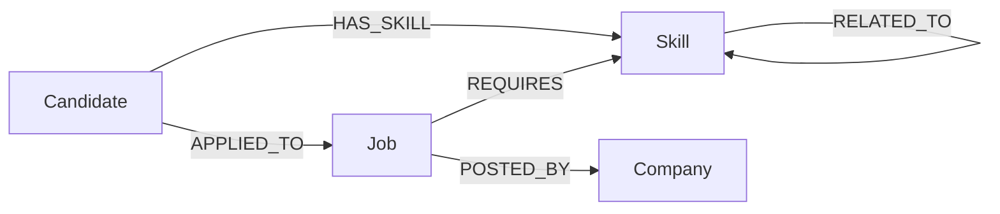

# JobGraph — Graph-Powered Job & Skill Explorer

A small full-stack application built for the WEXA AI CognoDB take-home assignment.

## What it does

JobGraph models candidates, skills, jobs, companies, and skill relationships in a graph database. A user can:

- Browse candidates and their skills
- Browse jobs and required skills
- See companies
- Get job recommendations for a candidate
- Explore direct and indirect skill relationships

## Why a graph database?

The important questions in JobGraph are about connections. A candidate is connected to skills, jobs are connected to required skills, jobs are connected to companies, and skills can be related to other skills.

A relational implementation can model this with several junction tables, but relationship-heavy discovery becomes increasingly join-oriented. In a graph, these questions are expressed directly as traversals. For example:

`Candidate -> HAS_SKILL -> Skill <- REQUIRES <- Job`

and the multi-hop recommendation:

`Candidate -> HAS_SKILL -> Skill -> RELATED_TO -> Skill <- REQUIRES <- Job`

This makes graph traversal the core of the application rather than an afterthought.

## Graph data model



### Nodes

- `Candidate`: id, name, email, experienceYears, location
- `Skill`: id, name, category
- `Job`: id, title, description, location, workMode, experienceMin
- `Company`: id, name, industry

### Relationships

- `Candidate-[:HAS_SKILL]->Skill`
- `Candidate-[:APPLIED_TO]->Job`
- `Job-[:REQUIRES]->Skill`
- `Job-[:POSTED_BY]->Company`
- `Skill-[:RELATED_TO]->Skill`

## Architecture

```text
React + Vite
     |
     | REST API
     v
Node.js + Express
     |
     | official neo4j-driver
     v
CognoDB (openCypher over Bolt)
```

## Main graph queries

### Candidate skills

```cypher
MATCH (c:Candidate {id: $candidateId})-[:HAS_SKILL]->(s:Skill)
RETURN c, s
ORDER BY s.name
```

### Direct job matches

```cypher
MATCH (c:Candidate {id: $candidateId})-[:HAS_SKILL]->(s:Skill)<-[:REQUIRES]-(j:Job)
WITH j, collect(DISTINCT s.name) AS matchingSkills
RETURN j.id AS id, j.title AS title, j.location AS location,
       j.workMode AS workMode, matchingSkills,
       size(matchingSkills) AS matchCount
ORDER BY matchCount DESC, title
```

### Multi-hop related-skill recommendations

```cypher
MATCH (c:Candidate {id: $candidateId})
      -[:HAS_SKILL]->(s:Skill)
      -[:RELATED_TO]->(related:Skill)
      <-[:REQUIRES]-(j:Job)
WHERE NOT (c)-[:HAS_SKILL]->(related)
WITH j, collect(DISTINCT related.name) AS relatedSkills
RETURN j.id AS id, j.title AS title, j.location AS location,
       j.workMode AS workMode, relatedSkills,
       size(relatedSkills) AS relatedMatchCount
ORDER BY relatedMatchCount DESC, title
```

This is the key indirect traversal in the application.

## Setup

### 1. Create a CognoDB instance

Create a free instance in the CognoDB Cloud console and copy the Bolt URI and generated password. The assignment specifies a URI like:

`bolt+s://<instance-id>.databases.cognodb.cloud`

Do not commit the password.

### 2. Configure the backend

Copy `backend/.env.example` to `backend/.env` and fill in your CognoDB details.

### 3. Install dependencies

```bash
cd backend
npm install

cd ../frontend
npm install
```

### 4. Seed the database

From `backend`:

```bash
npm run seed
```

The seed script creates constraints, nodes, and relationships.

### 5. Start the backend

```bash
cd backend
npm run dev
```

The API runs on `http://localhost:5000`.

### 6. Start the frontend

In another terminal:

```bash
cd frontend
npm run dev
```

Open the URL printed by Vite.

## Environment variables

Backend:

```env
PORT=5000
COGNODB_URI=bolt+s://your-instance.databases.cognodb.cloud
COGNODB_USERNAME=cognodb
COGNODB_PASSWORD=your-password
```

Frontend:

```env
VITE_API_URL=http://localhost:5000/api
```

Never commit either `.env` file.

## API endpoints

- `GET /api/health`
- `GET /api/dashboard`
- `GET /api/candidates`
- `GET /api/candidates/:id`
- `GET /api/candidates/:id/recommendations`
- `GET /api/jobs`
- `GET /api/jobs/:id`
- `GET /api/companies`
- `GET /api/skills`
- `GET /api/graph/:candidateId`

## UI

The application contains:

- Dashboard with graph statistics
- Candidates view
- Candidate detail with skills and recommendations
- Jobs view
- Job detail
- Companies view
- Graph Explorer showing a selected candidate's connected data

## Error handling

The backend returns a clear 503 response when CognoDB cannot be reached. The frontend displays loading, empty, and error states rather than failing silently.

## Seed data

The seed contains realistic demo data for candidates, skills, jobs, companies, applications, and related skills. It is intentionally small enough for the CognoDB free tier.

## Demo checklist

Before submission:

1. Start CognoDB.
2. Run `npm run seed`.
3. Start backend and frontend.
4. Test dashboard, candidate recommendations, jobs, companies, and graph explorer.
5. Deploy the frontend and backend.
6. Add deployment environment variables.
7. Take UI screenshots.
8. Add the screenshots to this README.
9. Record a short walkthrough.
10. Keep the CognoDB instance running until WEXA completes its review.
